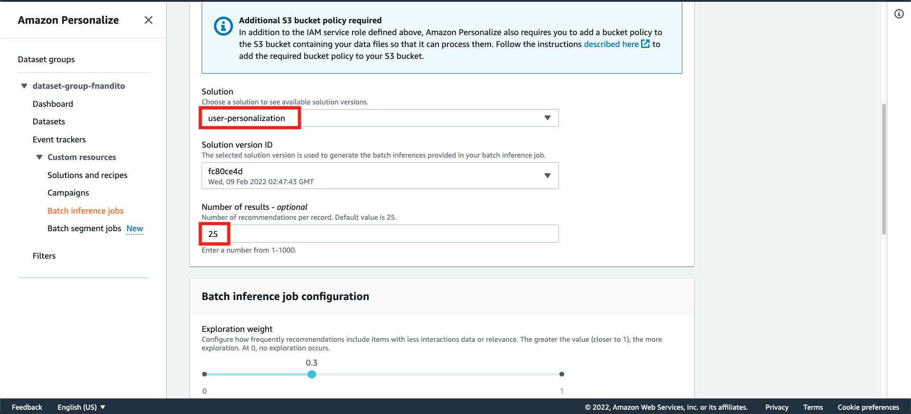
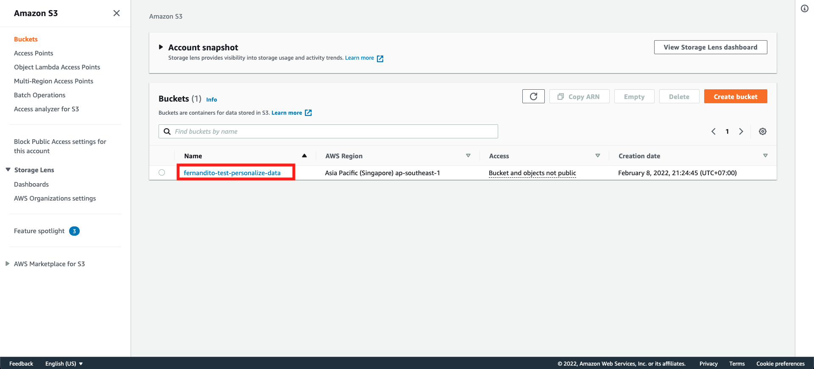

## Setup Batch Inference using Personalize

Personalize also supports batch Inference job, so you don't need to turn on your inference 24/7 all day. This is very good if you only need to predict the recommendation system not all the time, and very cost effective.

First, we need to update our S3 configurations.

1. Go to [S3 Console](https://s3.console.aws.amazon.com/s3/home?region=ap-southeast-1&region=ap-southeast-1)
2. click your bucket name
    

3. Click `Permissions` tab
    

4. In Bucket policy, click `Edit`
    

5. Copy this Bucket Policy

```
{
	"Version": "2012-10-17",
	"Id": "PersonalizeS3BucketAccessPolicy",
	"Statement": [
		{
			"Sid": "PersonalizeS3BucketAccessPolicy",
			"Effect": "Allow",
			"Principal": {
				"Service": "personalize.amazonaws.com"
			},
			"Action": [
				"s3:GetObject",
				"s3:ListBucket",
				"s3:PutObject"
			],
			"Resource": [
				"arn:aws:s3:::fernandito-test-personalize-data",
				"arn:aws:s3:::fernandito-test-personalize-data/*"
			]
		}
	]
}
```

6. Paste this Bucket policy to the S3 Console bucket policy, and click `Save Changes`
    

7. in S3 Bucket console you have, click `Create Folder`
    

8. Fill the folder name as `inputBatch` and click `Create Folder`
    

9. Repeat step 7 and 8, by creating another folder called `outputBatch` and click `Create Folder`
    

10. Download [this New Input](../Assets/PersonalizeBatch.json) data that will be predicted. This is the view of the data
    

11. Upload your New Data into `inputBatch` S3 Folder by clicking `Upload` button
    

12. Drag and drop your new data, or click `Add Files` and choose `PersonalizeBatch.json` file. Click Upload on S3
    

Once it's done, let's go back to personalize

13. go to [Personalize Console](https://ap-southeast-1.console.aws.amazon.com/personalize/home?region=ap-southeast-1#start)
14. Choose your dataset group, and click `Batch Inference jobs` menu. Click `Create batch inference job`
    

15. in Create batch inference job window, fill the batch inference name with `<yourname>-batch-inference-job-testing`, and choose IAM as `Enter a custom IAM role ARN` and fill it with IAM Role ARN you copied during IAM section.
    

16. Choose the solution as `user-personalization` solution, and fill the number of results as `25`.
    

17. Fill the S3 input path as `s3://<yourname>-test-personalize-data/inputBatch/PersonalizeBatch.json`, and the output input as `s3://<yourname>-test-personalize-data/outputBatch/`. Click `Create batch inference job`
    

Wait around 10 until 20 minutes to get your results.

18. Once it's done, it's status will change to `Active`
    

Let's check your S3 bucket to get the result

19. Go to [S3 Console](https://s3.console.aws.amazon.com/s3/home?region=ap-southeast-1)
20. Click your bucket name
    

21. Click Folder `outputBatch`
    

22. checklist `PersonliazeBatch.json.out` file, and click `Download`. Open it using your favourite text editor.
    

23. This is the example of the output result.
    

[BACK TO WORKSHOP GUIDE :house:](../README.md)

[BACK TO PREVIOUS GUIDE :arrow_left:](Personalize.md)