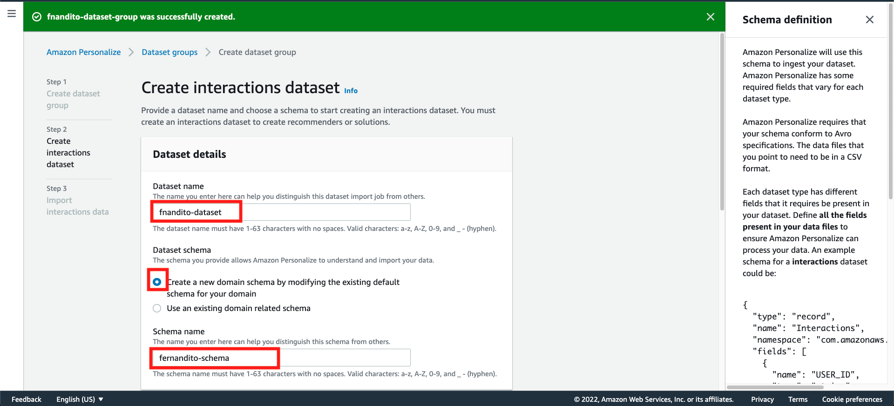
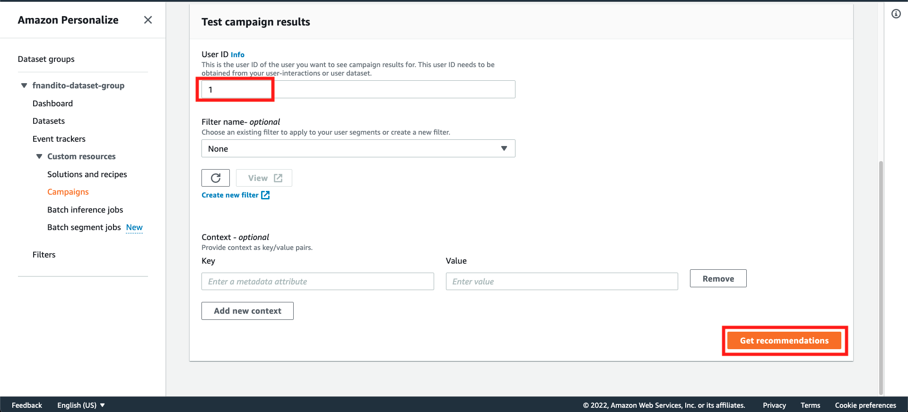

## Setup Real Time Recommendation System using Personalize

1. Go to [AWS Console](https://ap-southeast-1.console.aws.amazon.com/console/home?region=ap-southeast-1)
2. Type `Personalize` and click Personalize menu
    

3. Click `Get Started`
    

4. In `Create Dataset Group`, fill the name with format `<yourname>-dataset-group` and choose domain as `Custom`
    

Domain on this really depends on your use case for recommendation system. It mostly affects the data schema, but it doesn't affect the algorithms that is available for each of domains.

5. In `Create Interactions Dataset` page, fill the dataset name with `<yourname>-dataset`, choose the `create a new domain schema`, and fill your schema name with `<yourname>-schema`
    

6. Copy this JSON Format

```
{
  "type": "record",
  "name": "Interactions",
  "namespace": "com.amazonaws.personalize.schema",
  "fields": [
    {
      "name": "USER_ID",
      "type": "string"
    },
    {
      "name": "ITEM_ID",
      "type": "string"
    },
    {
      "name": "TIMESTAMP",
      "type": "long"
    },
    {
      "name": "EVENT_TYPE",
      "type": "string"
    }
  ],
  "version": "1.0"
}
```

7. Paste the JSON on Schema definition, and click `Create dataset and continue`
    

8. In `Import Interactions data`, choose data import source as `Import data from S3`, and fill your dataset import job name as `<yourname>-dataset-import-job`
    

9. Fill the data location by specifying your S3 path `s3://<yourname>-test-personalize-data/interactions.csv`, choose the IAM Service role as `Enter a custom IAM role ARN` and Paste the ARN you have received on IAM section. Click `Finish`
    

Your data will be exported approximately 5 minutes.

10. Once completed, Choose `Dataset` menu on your dataset group (yourname-dataset-group)
    

11. Choose `Item` dataset type and click `Create Dataset`
    

12. Same as previous step, Fill the dataset name for your item as `<yourname>-item-dataset`, choose the `create a new domain schema`, and fill the schema name by `<yourname>-item-schema`
    

13. Copy this item schema

```
{
	"type": "record",
	"name": "Items",
	"namespace": "com.amazonaws.personalize.schema",
	"fields": [
		{
			"name": "ITEM_ID",
			"type": "string"
		},
		{
			"name": "GENRE",
			"type": "string",
			"categorical": true
		},
		{
			"name": "YEAR",
			"type": "int"
		},
		{
			"name": "CREATION_TIMESTAMP",
			"type": "long"
		}
	],
	"version": "1.0"
}
```

14. Paste the schema to the Schema definition section, and click `Next`
    

15. In Configure item dataset import job, fill the dataset import job with `<yourname>-item-dataset-import-job`. Fill the data location as `s3://<yourname>-test-personalize-data/items.csv`
    

16. in IAM Role, choose `Enter a custom IAM role ARN` and paste the ARN IAM role we previously copied. Click `Start Import`
    

This import process might take several minutes. While waiting, let's try to train our model.

17. In your Dashboard Menu, choose `Create Solution`
    


We are going to try most sections of the personalize algorithms. Currently, we are focusing on Item recommendation. It's devided by 3 major use cases.
* Similar Items -> Finding similar items between items that might relate towards each other.
* Personalized Ranking -> Rank your list of items that you specify towards specific user.
* User Personalization -> Each user will be given recommendation of all items that is available.
We are going to use 1 algorithm (called recipe) in each of this sections.

    


First, we are going to do it on Similar Items.

18. On Create solution page, fill the solutions name with `<yourname>-sims-solutions`. Choose `Item recommendation` for solution type, and choose `aws-sims` for the Recipe on `Similar Items` section.
    

19. Scroll down and click `Create and train solution`
    

20. Once it's running, we are going to test other 2 sections. On `Solutions and Recipes` menu, click `Create solution`
    

21. Repeat the process, but choose different algorithms. For `Personalized Ranking` section, choose `aws-personalized-ranking`. For `User Personalization`, choose `aws-user-personalization`
    

    

We need to wait approximately 15-30 minutes for training process to be completed.

22. Once it's done, We are going to launch it in real time manner. Choose `Campaigns` menu and click `Create campaign`
    

23. In Campaign Details, fill the campaign name with `sims-campaign`. Choose your sims solutions (`yourname-sims-solutions`) and click `Create Campaign`
    

24. Repeat the process for `personalized-reranking` and `user-personalization`. In Campaign menu, click `Create Campaign`
    

    

25. For `user-personalization`, there is something called Exploration, meaning that it will recommend a low interaction items if the value of exploration is getting to 1. The higher, means the recommendation system will recommend a lower interaction items more, and vice versa.
    

You need to wait for about 10 to 20 minutes for all the models to be ready.

26. Once your campaign status are all active, Let's test it out. Click `sims-campaign` first to test the similar items capability.
    

27. In Test campaign result, type any Item ID you would like to check, and click `Get recommendations`
    

28. It will give all the items that is similar with item ID that you have typed.
    

29. Let's check re-ranking algorithm now. Go to Campaigns, and click `personalized-ranking-campaign`
    

30. In reranking algorithm, specify the user id and also list of item id that you want to recommend to that user. Click `Get personalized item rankings` and it will display the prediction result.
    

31. Based on the result, it will sort the highest recommended at the top (highest score) until the lowest score
    

32. Repeat the process For user-personalization. Specify the user id and click `Get recommendations`
    

33. user-personalization algorithm will list out all items that is going to be strongly recommended to the user, based on the activity the user had.
    

[BACK TO WORKSHOP GUIDE :house:](../README.md)

[CONTINUE TO NEXT GUIDE :arrow_right:](Batch.md)

[BACK TO PREVIOUS GUIDE :arrow_left:](SetupAccess.md)