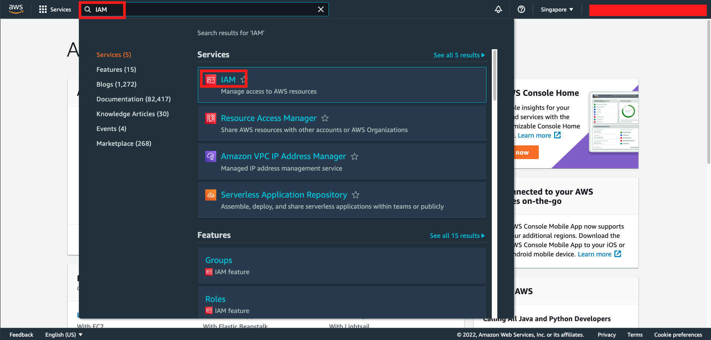
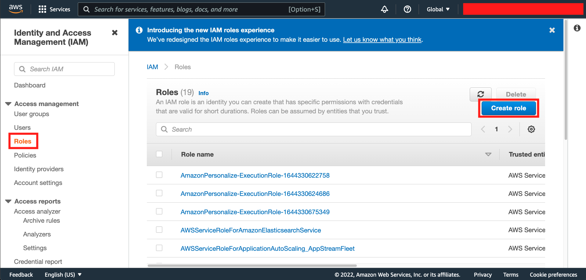
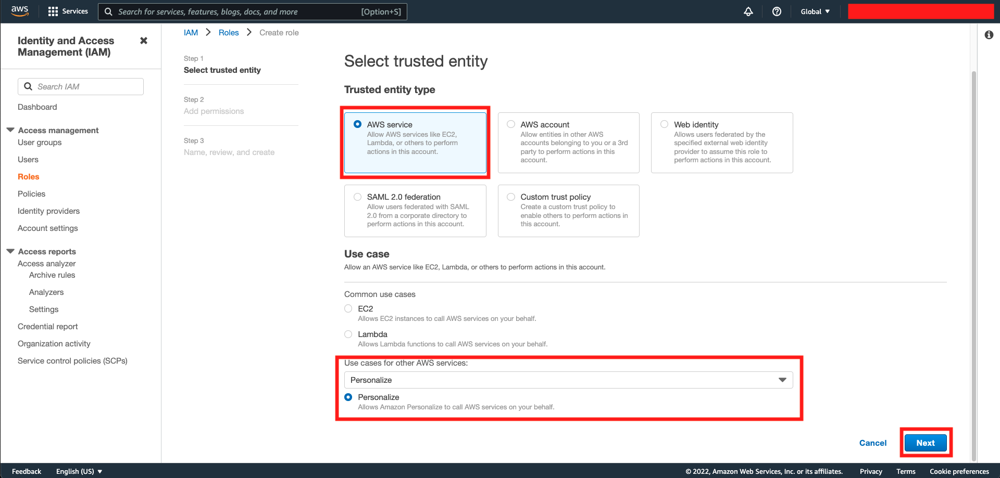
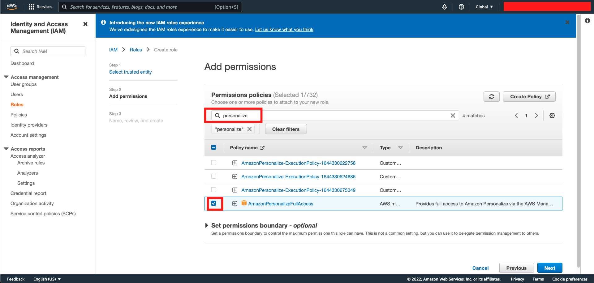
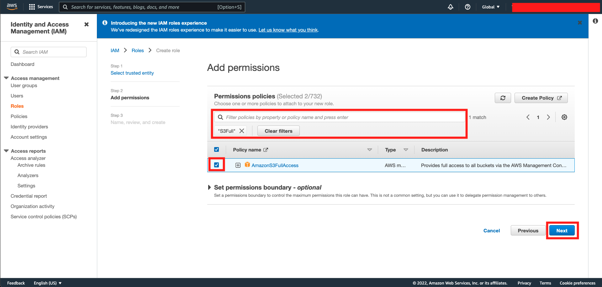
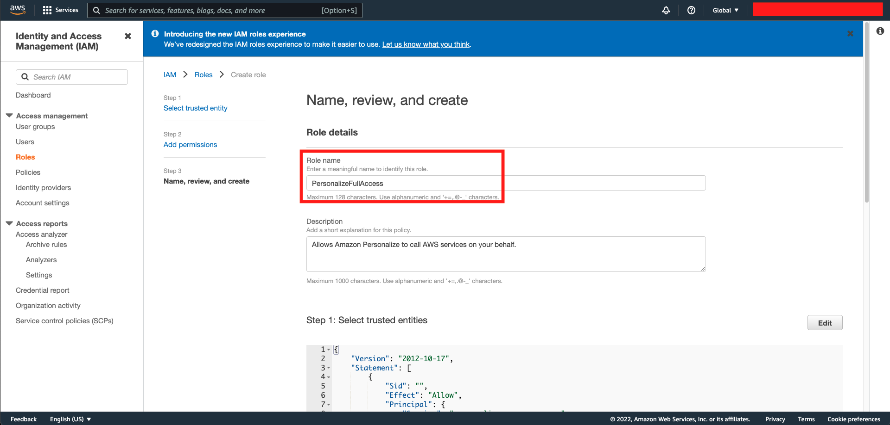
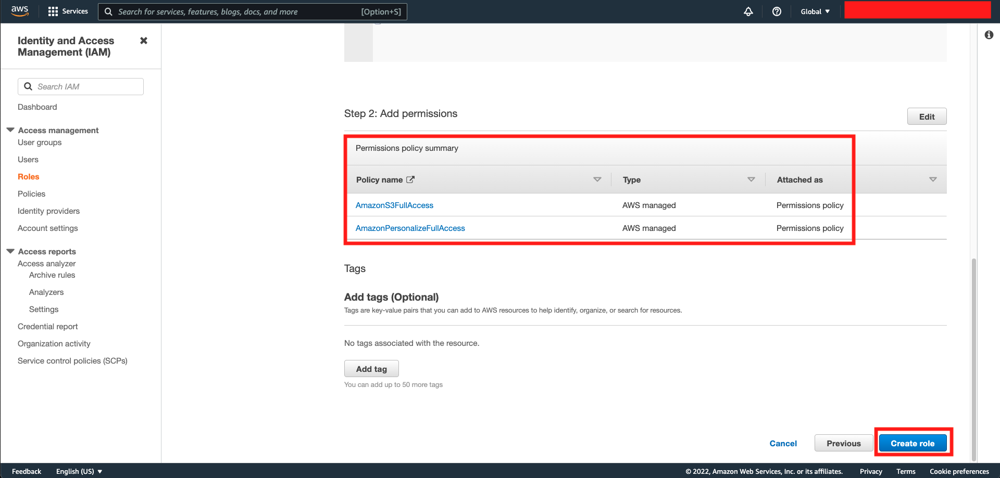
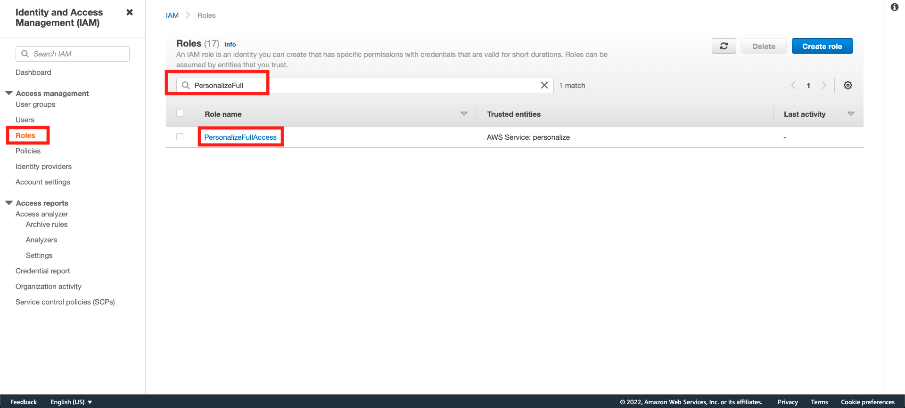
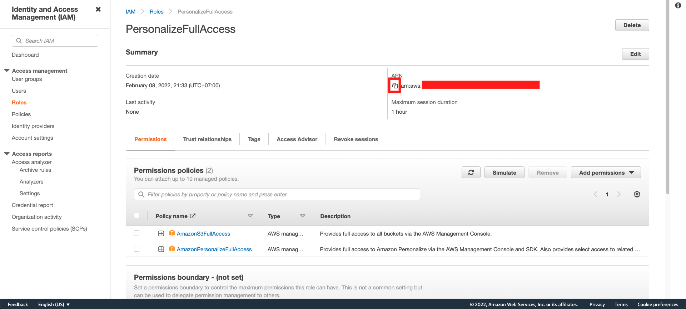

## Setup S3 Bucket Access to Personalize

Now, we need to simply giving the permission for our personalize to access our data that has been stored on our object storage service (S3)

1. Go to [AWS Console](https://ap-southeast-1.console.aws.amazon.com/console/home?region=ap-southeast-1)
2. Type `IAM` and click IAM menu
    

3. In IAM Console, click Roles and click `Create Role` Button
    

4. In trusted entity, choose `AWS Service` and search `Personalize` as AWS Service, and click Next
    

5. Type `Personalize` on the textbox and click enter. Click the checkbox besides `AmazonPersonalizeFullAccess`
    

6. Delete the `Personalize` word below the text box by clicking the `X` button. Type `S3Full` on the textbox and click enter. Click the checkbox besides `AmazonS3FullAccess`, and click `Next`
    

7. Name your role by filling the name with `PersonalizeFullAccess`
    

8. Make sure to check both `AmazonPersonalizeFullAccess` and `AmazonS3FullAccess` existed on the policy summary. Once it's good, click `Create Role`
    

9. In Roles menu on IAM Console, Search "PersonalizeFullAccess" Role Name (the one that we had created) and click the role name
    

10. Copy the ARN text and paste it to your favourite text editor. We are going to need it later.
    

[BACK TO WORKSHOP GUIDE :house:](../README.md)

[CONTINUE TO NEXT GUIDE :arrow_right:](Personalize.md)

[BACK TO PREVIOUS GUIDE :arrow_left:](SetupData.md)