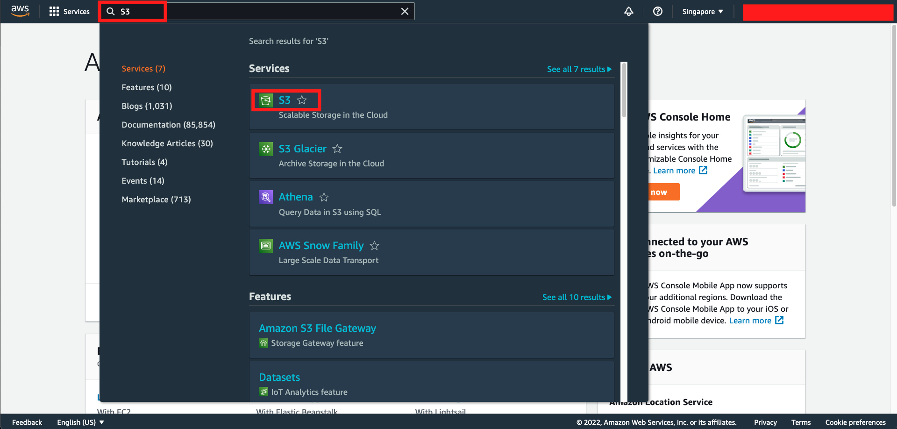
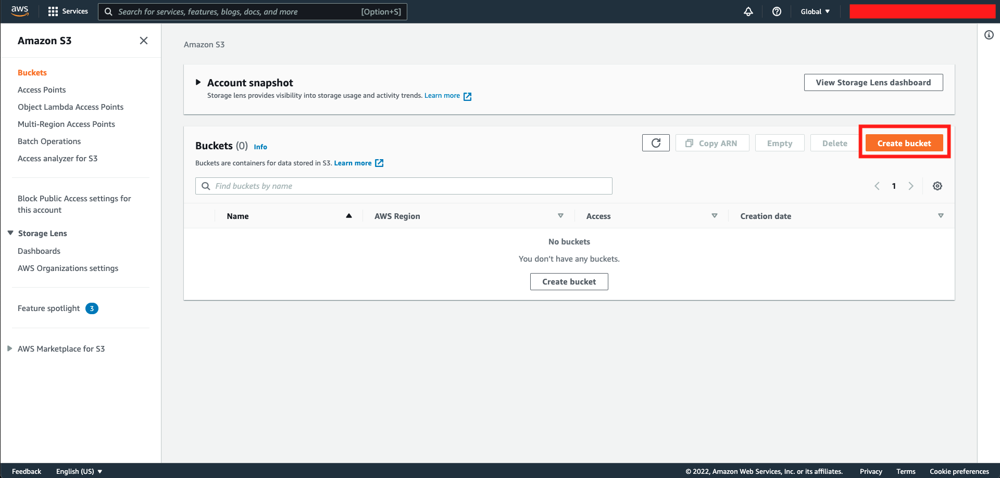
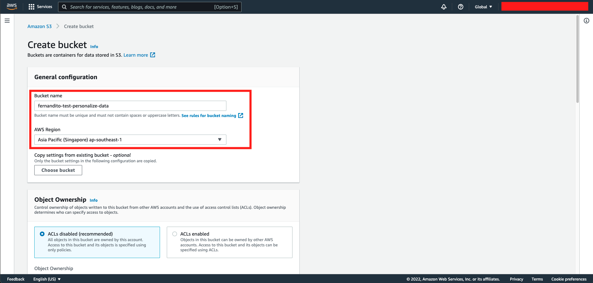
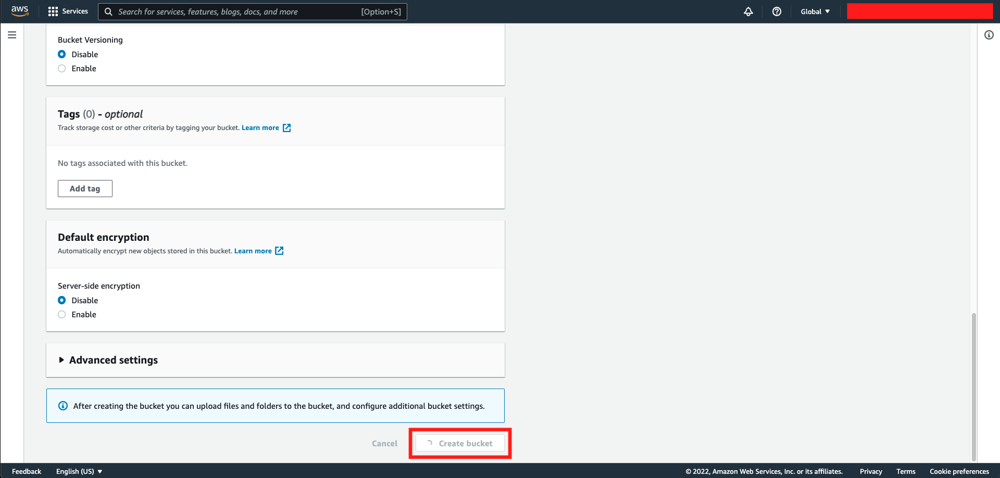
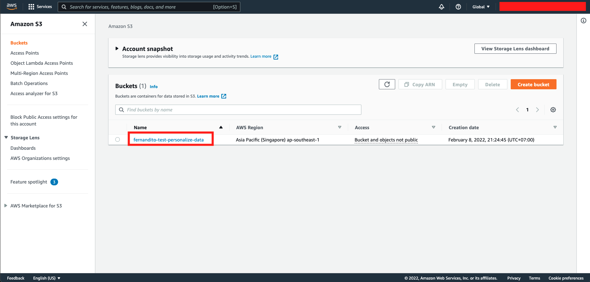
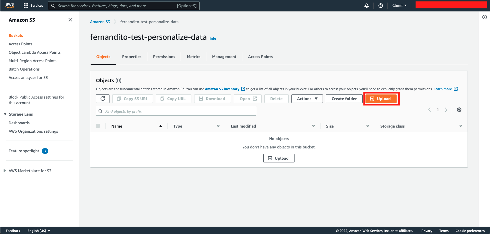
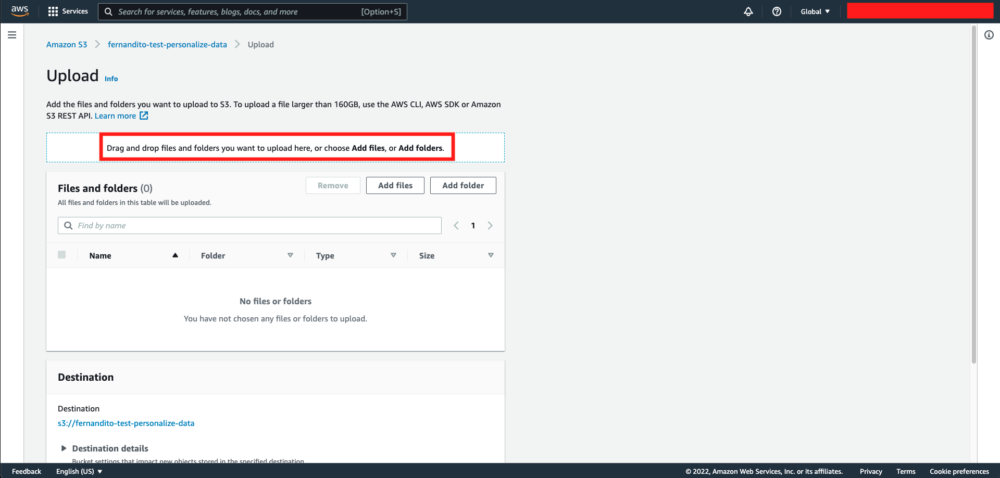
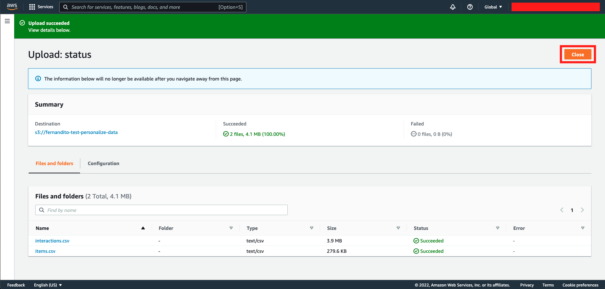

## Setup Data for Recommendation System

To try it out, we need to setup the data. By using Object Storage called S3 (Simple Storage Service), It stores the data for our recommendation system.

1. Go to [AWS Console](https://ap-southeast-1.console.aws.amazon.com/console/home?region=ap-southeast-1)
2. Type `S3` and click the S3 menu
    

3. In S3 Console, Click `Create Bucket`
    

4. Fill the bucket name with format `<yourname>-test-personalize-data` and check if the `Region` is in `ap-southeast-1`
    

5. Scroll down and click `Create Bucket`
    

6. Once it's done, click your own bucket name. It will display an empty bucket
    

7. Click `Upload`
    

8. Download this [Interactions Data](../Assets/interactions.csv) and [Items Data](../Assets/items.csv) by right clicking and choose "Open in a new Tab" and click "Download" or "Raw". Once the page is open, choose "Save As".
9. Once you download the data, upload it to S3 by dragging it and drop it to the console, or simply click `Add Files` and choose your files.
    

10. Scroll down and click `Upload`
11. It will be successfully downloaded. Click `Close`
    

[BACK TO WORKSHOP GUIDE :house:](../README.md)

[CONTINUE TO NEXT GUIDE :arrow_right:](SetupAccess.md)